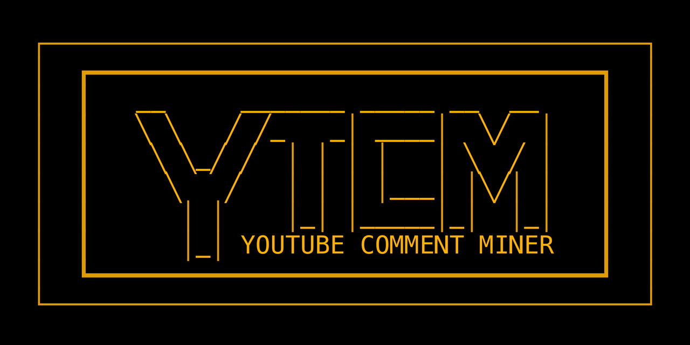

# About YTCM

For *user documentation*, see `YTCM101.md`. For the *technical documentation*, see `YTCM102.md`. Both files have been automatically generated by Claude Opus 5; please contact me if you find errors in them.

Over more than twenty years, YouTube (www.youtube.com) has grown into one of the largest music archives on the internet. Under nearly every video, there is a comments section, sometimes filled, sometimes not. YTCM, the "YouTube Comment Miner," collects these comments for all kinds of cultural analyses as time series, as text corpora, and as networks. YTCM itself is not strictly restricted to analyzing music discourse, but may be applied to a lot of questions in platform studies. However, what comes out is not "the truth;" analyzing comments opens a whole new range of methodological questions, starting with the simple observation that comments are what a small and unusually active part of YouTube's audience has produced, not the vast "silent majority."

YTCM has started as a small 1000-lines script in 2023, in a seminar at the Department of Musicology at the University for Music and Theater in Leipzig, Germany (HMT). Its original question was how people write about the music of Ethel Smyth. Since then, YTCM has grown and meandered, with major impulses given by two joint research projects by HMT and Ritsumeikan University Kyōto (Prof. Dr. Martin Roth). Currently, YTCM has five major components. A **base module** searches YouTube, downloads videos, comments and replies, pseudonymizes and ultimately anonymizes them and writes them to a local database. Then, four analysis modules can work on these data: **TubeScope** for numerical statistics and timelines (counts, distributions: basically, everything countable that happens over time); **TubeTalk** for NLP (language and sentiment detection, word clouds, topic models, hashtags: basically, everything language-related); **TubeGraph** for the individual network analysis (components, community detection, centrality measures), and **TubeConnect** asking about the overlap of different communities.

All this runs in an interactive shell with currently 66 commands (Natasha Niaz has also built a web interface). Most commands will ask for parameters, then compute and save, print, or plot the result. This can take some time, depending on the database size and the local hardware it runs on. Analyses of large databases on weak hardware may well run for hours and, possibly, days. But YTCM can also delegate these tasks to specialists: it can export data as JSON, JSONL, CSV, TXT, HTML, or Gephi files, for use in tools like MAXQDA, Voyant, Gephi, or in interactive pandas analyses, R, Jupyter Notebooks, etc.

The data corpus is saved as an SQLite database. There are some protections against data loss in place: downloads resume after interruptions, corpora can be exported, moved, and imported again without losing fields. When working on a project, it is always better to do regular local backups. YTCM has been tested on corpora from a few hundred thousand up to 1.2 million comment/reply entries.

YTCM tries to replace all channel IDs, display names, known social media handles, and email addresses with keyed tokens. This is done automatically with channel IDs and display names during the download, so that this data never even reaches the main database in the default mode. Comment texts are first stored as written. To anonymize them as well, export the database to JSON, then re-import this JSON file into a fresh database with `import --sanitize --mode merge`. When all analyses are done, either delete the whole downloaded data (there is a `reset` command for that), or delete the key with `deletehash` to finalize the anonymization. If you have set `LOOKUP_DIR`, also run `deletelookup` to prevent any re-identification. In rare cases, error messages in the log files may contain snippets of personal data; so delete the log file folder as well when you archive the results. Remember to delete any exported files that may contain un-anonymized data. Always install YTCM in a local, non-cloudsynced folder, not in Dropbox, iCloud, etc. (Further, SQLite does not work well with such services.)

However, personal data may still remain in the corpus if YTCM's filters did not find them. You are responsible for deleting these remains yourself. YTCM is not meant to produce publishable anonymized corpora, but corpora on your local system with reasonable anonymization measures to run your analyses on. In all respects, you are using YTCM at your own risk: if you do use it, you are responsible. Do not use it if you do not agree with this.

YTCM builds on YouTube's official API. You need your own API key to access the search and download functionality, but you can run analyses on existing databases without. Procedures how to get an API key are explained on YouTube's and Google's websites. There is also an option to use a local LLM embedding model for YTCM's semantic analysis, and Qwen via Ollama is set as a default.

Do not expect any groundbreaking methodology here; YTCM does not invent anything from scratch, but tries to adapt what is already in use: it tries to integrate downloading and analysis functions into a tool that can serve as an environment for basic analysis, to be followed by corpus export to more specialized tools that YTCM does not even try to (and would never be able to) imitate. Much of its design still reflects its original purpose, namely the musicological analysis of East Asian popular music cultures, and many features have been added *ad hoc* around that initial focus. Still, we believe that it is useful to have many different approaches such as this one documented online, since each models and focuses on a particular facet of YouTube and its cultural impact on (not only) music distribution and discourse.

YTCM has been written by *Christoph Hust* (since 2023), together with *Natasha Niaz* (since 2026). Performance and algorithmic optimization, database migration, debugging, security issue search and code hardening (including additional coding), testing, packaging, and documentation done by Anthropic's Opus 5 and Claude Fable 5.1 LLM models on September 10–19, 2026.

YTCM is MIT licensed.